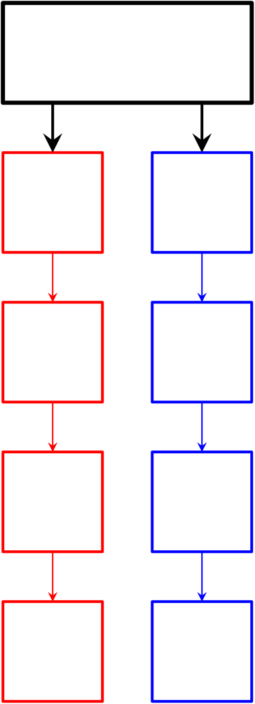

PUMA
====

<!-- START doctoc generated TOC please keep comment here to allow auto update -->
<!-- DON'T EDIT THIS SECTION, INSTEAD RE-RUN doctoc TO UPDATE -->
**Table of Contents**  *generated with [DocToc](https://github.com/thlorenz/doctoc)*

- [Design and Implementation](#design-and-implementation)
  - [Dynamic Memory Allocator](#dynamic-memory-allocator)
    - [Memory Pools](#memory-pools)
    - [Element Headers](#element-headers)
  - [Static Data](#static-data)
  - [Kernel Application](#kernel-application)
    - [Load Balancer](#load-balancer)
  - [Challenges](#challenges)
    - [Profiling](#profiling)
    - [Invalid Memory Accesses](#invalid-memory-accesses)
    - [Local vs. Remote Testing](#local-vs-remote-testing)
- [Compilation](#compilation)
  - [Dependencies](#dependencies)
  - [Configuration](#configuration)
- [Future Work](#future-work)
- [API Reference](#api-reference)
  - [PUMA Set Management](#puma-set-management)
  - [Memory Allocation](#memory-allocation)
  - [Kernel Application](#kernel-application-1)
  - [Static Data Allocation](#static-data-allocation)
- [Getting Started: Standard Deviation Hello World!](#getting-started-standard-deviation-hello-world)
- [Licence](#licence)

<!-- END doctoc generated TOC please keep comment here to allow auto update -->

Moore’s Law states that every eighteen months to two years, the number
of transistors per square inch on an integrated circuit approximately
doubles@Moore:1965, effectively leading to a proportional performance
gain. However, in the early twenty-first century, transistor size
reduction began to slow down, limiting the growth of complexity in
high-performance applications which was afforded by increasing computing
power.

Consequently, there was a push for increased parallelism, enabling
several tasks to be carried out simultaneously. For high-performance
computing applications, a logical extension to this was to utilise
multiple processors simultaneously in the same system, each with
multiple execution units, in order to increase parallelism with widely
available consumer hardware.

In multi-processor systems, having uniformly shared, globally accessible
physical memory means that memory access times are the same across all
processors. These accesses can be expensive, however, because they all
require communication with a remote node, typically across a bus which
is shared among the processors. Since the bus is shared and can only
handle one request at a time, processors may have to wait to use it,
causing delays when attempting to access memory.

The situation can be improved by giving each processor its own section
of memory, each with its own data bus. Each section of memory is called
a domain, and accessing a domain which is assigned to a different
processor requires the use of an interconnect which has a higher latency
than accessing local memory. This architecture is called NUMA
(Non-Uniform Memory Access). In order to exploit NUMA architectures
efficiently, application developers need to write code which minimises
so-called cross-domain accesses to maximise the application’s aggregate
memory performance.

We present PUMA, which is a smart memory allocator that manages data in
a NUMA-aware way. PUMA exposes an interface to execute a kernel on the
data in parallel, automatically ensuring that each core which runs the
kernel accesses primarily local memory. It also provides an optional
time-based load balancer which can adapt workloads to cases where some
cores may have be less powerful or have more to do per kernel invocation
than others.

Design and Implementation
=========================

PUMA consists of several parts:

-   A NUMA-aware dynamic memory allocator for homogeneous elements;

-   An allocator for thread-local static data which cannot be freed
    individually. This allocator uses pools which are located on the
    domain to which the core associated with the thread belongs;

-   A parallel iteration interface which applies a kernel to all
    elements in a PUMA set;

-   A balancer which changes which threads blocks of data are associated
    with in order to balance kernel runtime across cores.

Much of PUMA’s design was needs-driven: it was developed in parallel
with its integration into a case study and its design evolved as new
requirements became clear.

The reason that PUMA provides a kernel application function rather than
direct access to the underlying memory is to enable it to prevent
cross-domain accesses. We achieve this by pinning each thread in our
pool to a specific core and ensuring that when we run the kernel across
our threads, each thread can access only domain-local elements.

PUMA works under the assumption that the application involves the
manipulation of sets of homogeneous elements. In our case study, these
elements are the agents within the model, each of which represents a
group within the overall population of phytoplankton, and we use two
PUMA sets, one for each of dead and alive agents.

PUMA implements parallelism by maintaining a list of elements per
thread, each of which can only be accessed by a single thread at a time.

Dynamic Memory Allocator
------------------------

Our initial design involved an unordered data structure which could act
as a memory manager for homogeneous elements. It would provide methods
to map kernels across all of its elements and ensure that each element
would only be accessed from a processor belonging to the NUMA domain on
which it was allocated.

In order to achieve this, we use one list per thread within the
user-facing PUMA set structure (Figure [fig:thread~l~ists]). Each of
these lists contains one or more blocks of memory at least one virtual
memory page long. We have a 1:1 mapping of threads to cores, enabling a
mostly lock-free design. This allows us to have correct multithreaded
code while minimising time-consuming context switches.

[2] 

### Memory Pools

In order to allocate memory quickly on demand, our dynamic allocator
pre-allocates blocks, each of which is one or more pages long. This has
two purposes: only requesting large blocks from the Operating System
allows us to reduce the time spent on system calls; and the smallest
blocks on which system calls for the placement of data on NUMA domains
can operate are one page long and must be page aligned.

These blocks have descriptors at the start which contain information on
the memory which has been allocated from them. The descriptors also
contain pointers to the next and previous elements in their per-thread
list to allow for iteration over all elements.

Currently, block size is determined by a preprocessor definition at
compile time, because this size is integral to calculating the location
of metadata from an element’s address. It could also be determined at
run-time if set before any PUMA initialisation is performed by the
application.

### Element Headers

In order to free elements without exposing too much internal state to
the user, we must have some way of mapping elements’ addresses to the
blocks in which they reside. Originally, each element had a header
containing a pointer to its block’s descriptor. This introduces a
significant memory overhead, however, especially if the size of the
elements is small compared to that of a pointer.

PUMA should use few resources in order to give users as much freedom as
possible in its use. Consequently, we devised two separate strategies
for mapping elements to blocks’ descriptors. The first (Figure
[fig:headers~1~]) was based on the NUMA allocation system calls which we
were already using to allocate blocks for the thread lists. These calls
(specifically `numa_alloc_onnode()` and `numa_alloc_local()`) guarantee
that allocated memory will be page-aligned.

![Our first strategy for mapping elements to block descriptors. Darker
blue represents the block’s descriptor; light blue represents a page
header with a pointer to the block’s descriptor; red represents
elements; the vertical lines represent page boundaries; and white
represents unallocated space within the block.
[fig:headers~1~]](images/headers_1.png)

If we ensure that each page within a block has a header, we can store a
pointer in that header to the block’s descriptor. Finding the block
descriptor for a given element then simply involves rounding the
element’s address down to the next lowest multiple of the page size.

This has two major disadvantages, however:

-   In order to calculate the index of a given element or the address
    corresponding to an element’s index, we must perform a relatively
    complex calculation (between twenty and fifty arithmetic
    operations), as shown in listing [lst:perpagemetadata], rather than
    simple pointer arithmetic (up to five operations). These are common
    calculations within PUMA, so minimising their complexity is
    critical.

-   If the usable page size after each header is not a multiple of our
    element size, we can have up to `sizeof(element) - 1` bytes of
    wasted space. This is especially problematic with elements which are
    larger than our pages.

<!-- -->

    void* _getElement(struct pumaNode* node, size_t i)
    {
    	size_t pageSize = (size_t)sysconf(_SC_PAGE_SIZE);

    	char* arrayStart = node->elementArray;

    	size_t firstSkipIndex =
    			_getIndexOfElementOnNode(node, (char*)node + pageSize + sizeof(struct pumaHeader));
    	size_t elemsPerPage =
    			_getIndexOfElementOnNode(node, (char*)node + 2 * pageSize + sizeof(struct pumaHeader)) - firstSkipIndex;

    	size_t pageNum = (i >= firstSkipIndex) * (1 + (i - firstSkipIndex) / elemsPerPage);

    	size_t lostSpace =
    			(pageNum > 0) * ((pageSize - sizeof(struct pumaNode)) % node->elementSize)
    			+ (pageNum > 1) * (pageNum - 1) * ((pageSize - sizeof(struct pumaHeader)) % node->elementSize)
    			+ pageNum * sizeof(struct pumaHeader);

    	void* element = (i * node->elementSize + lostSpace + arrayStart);

    	return element;
    }

    size_t _getIndexOfElement(void* element)
    {
    	struct pumaNode* node = _getNodeForElement(element);

    	return _getIndexOfElementOnNode(node, element);
    }

    size_t _getIndexOfElementOnNode(struct pumaNode* node, void* element)
    {
    	size_t pageSize = (size_t)sysconf(_SC_PAGE_SIZE);
    	char* arrayStart = node->elementArray;
    	size_t pageNum = ((size_t)element - (size_t)node) / pageSize;

    	size_t lostSpace =
    			(pageNum > 0) * ((pageSize - sizeof(struct pumaNode)) % node->elementSize)
    			+ (pageNum > 1) * (pageNum - 1) * ((pageSize - sizeof(struct pumaHeader)) % node->elementSize)
    			+ pageNum * sizeof(struct pumaHeader);

    	size_t index = (size_t)((char*)element - arrayStart - lostSpace) / node->elementSize;

    	return index;
    }

Our second strategy (Figure [fig:headers~2~]) eliminated the need for
these complex operations while reducing memory overhead. POSIX systems
provide a function to request a chunk of memory aligned to a certain
size, as long as that size is $2^n$ pages long for some integer $n$. If
we ensure that block sizes also follow that restriction, we can allocate
`blockSize` bytes aligned to `blockSize`. Listing
[lst:pagealignedchunks] shows how we calculate the mapping between
elements and their indices with this strategy.

    size_t _getIndexOfElement(void* element)
    {
    	struct pumaNode* node = _getNodeForElement(element);

    	return _getIndexOfElementOnNode(element, node);
    }

    size_t _getIndexOfElementOnNode(void* element, struct pumaNode* node)
    {
    	char* arrayStart = node->elementArray;

    	size_t index = (size_t)((char*)element - arrayStart) / node->elementSize;

    	return index;
    }

    void* _getElement(struct pumaNode* node, size_t i)
    {
    	char* arrayStart = node->elementArray;

    	void* element = (i * node->elementSize + arrayStart);

    	return element;
    }

    struct pumaNode* _getNodeForElement(void* element)
    {
    	struct pumaNode* node =
    			(struct pumaNode*)((size_t)element &
    			~((pumaPageSize * PUMA_NODEPAGES) - 1));

    	return node;
    }

![Our second strategy for mapping elements to block descriptors. The
blue block represents the block’s descriptor; the red blocks represent
elements; and the vertical lines represent page boundaries. In this
example, blocks are two pages long.
[fig:headers~2~]](images/headers_2.png)

Static Data
-----------

After parallelising all of the trivially parallel code in our primary
case study, we found that we were still encountering a major bottleneck.
Profiling revealed that this was mostly caused by an otherwise innocuous
line in a pseudo random number generator. It was using a static variable
as the initial seed and then updating the seed each time it was called,
as shown in listing [lst:staticrnd].

    float rnd(float a)
    {
    	static int i = 79654659;
    	float n;

    	i = (i * 125) % 2796203;
    	n = (i % (int) a) + 1.0;
    	return n;
    }

As we increased our number of threads, writing to the seed required
threads to wait for cache synchronisation between cores, and using cores
belonging to multiple NUMA domains incurred lengthy cross-domain
accesses.

The cache coherency problem could be solved to an extent using
thread-local storage such as that provided by
`#pragma omp threadprivate(...)`. However, since there are no guarantees
about the placement of thread-local static storage in relation to other
threads’ variables, multiple thread-local seeds can still be located
within the same cache line, leading to synchronisation. This also means
that we cannot optimise for NUMA without a more problem-specific static
memory management scheme.

We implemented a simple memory allocator which can allocate blocks of
variable sizes but not `free()` them individually. The lack of support
for `free()`ing allows us to avoid having to search for empty space
within our available heap space while still allowing for variable-sized
allocations. This then places the responsibility for retaining reusable
blocks on the application developer.

This allocator is primarily for static data which is accessed regularly
when running a kernel, such as return values or seeds.

This allocator returns blocks of data which are located on the NUMA
domain local to the CPU which calls the allocation function. The main
differences between it and PUMA’s primary memory allocator are:

-   The user is expected to keep track of allocated memory;

-   The allocator enables variable sizes;

-   Allocated blocks cannot be individually `free()`d.

Kernel Application
------------------

PUMA does not provide any way of retrieving individual elements from its
set of allocated elements. Instead, it exposes an interface for applying
kernels to all elements. This interface also enables the specification
of functions used to manipulate extra data which is to be passed into
the kernel. With this, we can manipulate the data in the set as long as
our manipulation can be done in parallel and is not order-dependent.

The extra data which is passed into the kernel is thread-local in order
to avoid cache coherency overhead and expensive thread synchronisation.
Consequently, we also allow the user to specify a reduction function
which is executed after all threads have finished running the kernel and
has access to all threads’ extra data.

### Load Balancer

When a kernel is run with PUMA, it first balances all of the per-thread
lists at a block level based on timing data from previous runs. If one
thread has recently finished running kernels significantly faster than
other threads on average, we transfer blocks from slower threads to it
in order to increase its workload.

Challenges
----------

### Profiling

One of the most challenging aspects of developing PUMA was identifying
the location and type of bottlenecks. Most profiling tools we
encountered, such as Intel’s VTune Amplifier@website:Intel:VTune and GNU
gprof@website:GNU:gprof are time- or cycle-based. VTune also provides
metrics to do with how OpenMP is utilised. However, finding hotspots of
cross-domain activity was still a matter of making educated guesses
based on abnormal timing results from profilers.

VTune and a profiler called Likwid@website:Likwid also provide access to
hardware counters, which can be useful for profiling cross-domain
accesses. However, without superuser access, it can be difficult to
obtain hardware counter-based results from these tools which can be used
for profiling; only the counters’ total values from the entire run are
shown, meaning that identifying hotspots is still a matter of guesswork.

### Invalid Memory Accesses

Because PUMA includes a memory allocator, we encountered several bugs
regarding accessing invalid memory and corrupting header data.

In order to prevent these bugs, we use Valgrind’s@website:valgrind error
detection interface to make our allocator compatible with Valgrind’s
memcheck utility. This enables Valgrind to alert the user if they are
reading from uninitialised memory or writing to un-allocated or
`free()`d memory.

This is not fully implemented, however; ideally, we would have Valgrind
protect all memory containing metadata. However, it is possible for
multiple threads to read each other’s metadata at once (without writing
to it). Reading another thread’s metadata requires marking it as valid
before reading and marking it as invalid after.

Due to the non-deterministic nature of thread scheduling, this could
sometimes lead to interleaving of validating and invalidating memory in
such a way that between a thread validating memory and reading it,
another thread may have read the memory and then invalidated it.

We decided that since overwriting this per-thread metadata was unlikely
compared to other memory access bugs, it was sensible to avoid
protecting these blocks of memory entirely in order to avoid false
positives in Valgrind’s output.

### Local vs. Remote Testing

NUMA-based architectures are not particularly prevalent in current
consumer computers. Consequently, the majority of our testing of the
NUMA-based sections of PUMA had to be performed while logged into a
remote server.

It is, however, possible to perform some of this NUMA-based testing on a
non-NUMA machine. While it is not particularly useful for gathering
timing data, the qemu virtual machine has a configuration option
enabling NUMA simulation, even on non-NUMA machines. This can be useful
for testing robustness and correctness of NUMA-aware
applications.@website:qemukvm:manpage.

Compilation
===========

Compilation of PUMA requires a simple `make` invocation in the PUMA root
directory. The make targets are as follows:

-   all: Build PUMA and docs and run unit tests

-   doc: Build documentation with doxygen

-   no\_test: Build PUMA without running unit tests

-   clean: Clear the working tree

-   docs\_clean: Clear all built documentation

Dependencies
------------

PUMA relies on the following:

-   libNUMA

-   C99 compatible compiler

-   Valgrind (optional)

-   OpenMP (optional)

-   Doxygen (optional, documentation)

Configuration
-------------

The following are configuration options for public use. For options
which are either enabled or disabled, 1 enables and 0 disables.

-   PUMA\_NODEPAGES: Specifies the number of pages to allocate per chunk
    in the per-thread chunk list. Default 2

-   OPENMP: Enable OpenMP. If disabled, we use PUMA’s pthread-based
    thread pooling solution (experimental). Default enabled

-   STATIC\_THREADPOOL: If enabled and we are not using OpenMP, we share
    one thread pool amongst all instances of PUMASet. Default disabled

-   BINDIR: Where we place the build shared library. Default
    {pumadir}/bin

-   VALGRIND: Whether we build with valgrind support. Default enabled

The following are configuration options for use during PUMA development.
They may severely hurt performance so should never be used in
performance-critical code.

-   DEBUG: Enable assertions. Default disabled

Future Work
===========

We have designed PUMA to internally abstract away OS-specific interfaces
for simplicity. While the systems on which PUMA has been tested are
POSIX-based, Windows also provides NUMA libraries. In the future, it
would be useful to port PUMA to Windows so that applications using PUMA
are not bound to POSIX systems.

A major feature which would make PUMA more able to take advantage of
modern distributed systems is MPI support. This would mainly require
changes to the balancing and reduction sections of kernel application,
and would enable further parallelisation.

In order to help PUMA adoption, we would like to create bindings for
languages such as Python and Fortran, both of which are prevalent in
scientific computing. There exist tools for both languages to interface
with C functions, so this should require very little work in exchange
for broader applicability of PUMA.

In section [sec:challenges:profiling], we discuss the potential
usefulness of NUMA memory access profiling. During PUMA’s development,
we briefly explored various methods for the creation of a profiler which
would not require superuser privileges and perform line-by-line
profiling of memory accesses, specifically identifying spots where many
cross-domain accesses were performed and where cache synchronisation
dominated timing. Unfortunately, it was too far outside the scope of
PUMA to realistically explore in depth.

We examined two possible strategies for the implementation of such a
profiler:

-   Using some debugging library (such as LLDB’s C++
    API@website:LLDB:API) to trap every memory access and determine the
    physical location of the accessed address in order to count
    off-domain accesses;

-   Building on Valgrind, which translates machine code into its own
    RISC-like language before executing the translated code, to count
    off-domain accesses. Valgrind could also be used to examine cache
    coherency latency by adapting Cachegrind, a tool which profiles
    cache utilisation.

API Reference
=============

[chap:api~r~eference]

PUMA Set Management
-------------------

    struct pumaSet* createPumaSet(size_t elementSize, size_t numThreads, char* threadAffinity);

Creates a new `struct pumaSet`.

Arguments:

l X `elementSize` & Size of each element in the set.\
`numThreads` & The number of threads we want to run pumaSet on.\
`threadAffinity` & An affinity string specifying the CPUs to which to
bind threads. Can contain numbers separated either by commas or dashes.
“i-j” means bind to every cpu from i to j inclusive. “i,j” means bind to
i and j. Formats can be mixed: for example, “0-3, 6, 10, 12, 15, 13” is
valid.If `NULL`, binds each thread to the CPU whose number matches the
thread (tid 0 == cpu 0 :: tid 1 == cpu 1 :: etc.).If non-`NULL`, must
specify at least as many CPUs as there are threads.

\

------------------------------------------------------------------------

    void destroyPumaSet(struct pumaSet* set);

Destroys and frees memory from the `struct pumaSet`.\

------------------------------------------------------------------------

    size_t getNumElements(struct pumaSet* set);

Returns the total number of elements in the `struct pumaSet`.\

------------------------------------------------------------------------

    typedef size_t (splitterFunc)(void* perElemBalData, size_t numThreads,
    		void* extraData);

Signature for a function which, given an element, the total number of
threads and, optionally, a void pointer, will specify the thread with
which to associate the element.

Arguments:

l X `perElemBalData` & Per-element data passed into
`pumallocManualBalancing()` which enables the splitter to choose the
placement of the associated element.\
`numThreads` & The total number of threads in use.\
`extraData` & Optional extra data, set by calling
`pumaListSetBalancer()`.

\

------------------------------------------------------------------------

    void pumaSetBalancer(struct pumaSet* set, bool autoBalance, splitterFunc* splitter, void* splitterExtraData);

Sets the balancing strategy for a `struct pumaSet`.

Arguments:

l X `set` & Set to set the balancing strategy for.\
`autoBalance` & Whether to automatically balance the set across threads
prior to each kernel run.\
`splitter` & A pointer to a function which determines the thread with
which to associate new data when `pumallocManualBalancing()` is called.\
`splitterExtraData` & A void pointer to be passed to the splitter
function each time it is called.

Memory Allocation
-----------------

    void* pumalloc(struct pumaSet* set);

Adds an element to the `struct pumaSet` and returns a pointer to it. The
new element is associated with the CPU on which the current thread is
running.\

------------------------------------------------------------------------

    void* pumallocManualBalancing(struct pumaSet* set, void* balData);

Adds an element to the `struct pumaSet` and returns a pointer to it.
Passes `balData` to the set’s splitter function to determine the CPU
with which to associate the new element.\

------------------------------------------------------------------------

    void* pumallocAutoBalancing(struct pumaSet* set);

Adds an element to the `struct pumaSet` and returns a pointer to it.
Automatically associates the new element with the CPU with the fewest
elements.\

------------------------------------------------------------------------

    void pufree(void* element);

Frees the specified element from its set.

Kernel Application
------------------

    struct pumaExtraKernelData
    {
    	void* (*extraDataConstructor)(void* constructorData);
    	void* constructorData;
    	void (*extraDataDestructor)(void* data);
    	void (*extraDataThreadReduce)(void* data);
    	void (*extraDataReduce)(void* retValue, void* data[],
    			unsigned int nThreads);
    	void* retValue;
    };

A descriptor of functions which handle extra data for kernels to pass
into runKernel().

Members:

l X `extraDataConstructor` & A per-thread constructor for
extra data which is passed into the kernel.\
`constructorData` & A pointer to any extra data which may be required by
the constructor. May be `NULL`.\
`extraDataDestructor` & A destructor for data created with
`extraDataConstructor()`.\
`extraDataThreadReduce` & A finalisation function which is run after the
kernel on a per-thread basis. Takes the per-thread data as an argument.\
`extraDataReduce` & A global finalisation function which is run after
all threads have finished running the kernel. Takes retValue, an array
of the extra data for all threads and the number of threads in use.\
`retValue` & A pointer to a return value for use by extraDataReduce. May
be `NULL`.\

\

------------------------------------------------------------------------

    void initKernelData(struct pumaExtraKernelData* kernelData,
    		void* (*extraDataConstructor)(void* constructorData),
    		void* constructorData,
    		void (*extraDataDestructor)(void* data),
    		void (*extraDataThreadReduce)(void* data),
    		void (*extraDataReduce)(void* retValue, void* data[],
    				unsigned int nThreads),
    		void* retValue);

Initialises `kernelData`. Any or all of the arguments after `kernelData`
may be `NULL`. Any `NULL` functions are set to dummy functions which do
nothing.\

------------------------------------------------------------------------

    extern struct pumaExtraKernelData emptyKernelData;

A dummy descriptor for extra kernel data. Causes `NULL` to be passed to
the kernel in place of extra data.\

------------------------------------------------------------------------

    typedef void (*pumaKernel)(void* element, void* extraData);

The type signature for kernels which are to be run on a PUMA list.

Arguments:

l X `element` & The current element in our iteration.\
`extraData` & Extra information specified by our extra data descriptor.\

\

------------------------------------------------------------------------

    void runKernel(struct pumaSet* set, pumaKernel kernel, struct pumaExtraKernelData* extraDataDetails);

Applies the given kernel to all elements in a `struct pumaSet`.

Arguments:

l X `set` & The set containing the elements to which we
want to apply our kernel.\
`kernel` & A pointer to the kernel to apply.\
`extraDataDetails` & A pointer to the structure specifying the extra
data to be passed into the kernel.\

\

------------------------------------------------------------------------

    void runKernelList(struct pumaSet* set, pumaKernel kernels[],
    		size_t numKernels, struct pumaExtraKernelData* extraDataDetails);

Applies the given kernels to all elements in a `struct pumaSet`. Kernels
are applied in the order in which they are specified in the array.

Arguments:

l X `set` & The set containing the elements to which we
want to apply our kernels.\
`kernels` & An array of kernels to apply.\
`numKernels` & The number of kernels to apply.\
`extraDataDetails` & A pointer to the structure specifying the extra
data to be passed into the kernels.\

Static Data Allocation
----------------------

    void* pumallocStaticLocal(size_t size);

Allocates thread-local storage which resides on the NUMA domain to which
the CPU which executes the function belongs.

Arguments:

l X `size` & The number of bytes we want to allocate.

\

------------------------------------------------------------------------

    void* pumaDeleteStaticData(void);

Deletes all static data associated with the current thread.

Getting Started: Standard Deviation Hello World!
================================================

In lieu of the traditional “Hello World” introductory program, we
present a PUMA-based program which generates a large set of random
numbers between 0 and 1 and uses the reduction mechanism of PUMA to
calculate the set’s standard deviation.

In order to calculate the standard deviation, we require three things: a
kernel, a constructor for the per-thread data and a reduction function.
In the constructor, we use the `pumallocStaticLocal()` function to
allocate a static variable on a per-thread basis which resides in memory
local to the core to which each thread is pinned.

This interface for allocating thread-local data are only intended to be
used for static data whose lifespan extends to the end of the program.
It is possible to delete all static data which is related to a thread,
but it is more sensible to simply reuse the allocated memory each time
we need similarly-sized data on a thread. This requires the use of
pthread keys in order to retrieve the allocated pointer each time it is
needed.

    // puma.h contains all of the puma public API declarations we need.
    #include "puma.h"
    #include <math.h>
    #include <pthread.h>
    #include <stdlib.h>
    #include <stdio.h>
    #include <getopt.h>

    pthread_key_t extraDataKey;
    pthread_once_t initExtraDataOnce = PTHREAD_ONCE_INIT;

    static void initialiseKey(void)
    {
    	pthread_key_create(&extraDataKey, NULL);
    }

    struct stdDevExtraData
    {
    	double sum;
    	double squareSum;
    	size_t numElements;
    };

    static void* extraDataConstructor(void* constructorData)
    {
    	(void)pthread_once(&initExtraDataOnce, &initialiseKey);

    	void* stdDevExtraData = pthread_getspecific(extraDataKey);

    	if(stdDevExtraData == NULL)
    	{
    		stdDevExtraData = pumallocStaticLocal(sizeof(struct stdDevExtraData));
    		pthread_setspecific(extraDataKey, stdDevExtraData);
    	}

    	return stdDevExtraData;
    }

    static void extraDataReduce(void* voidRet, void* voidData[],
    		unsigned int nThreads)
    {
    	double* ret = (double*)voidRet;
    	double sum = 0;
    	double squareSum = 0;
    	size_t numElements = 0;

    	for(unsigned int i = 0; i < nThreads; ++i)
    	{
    		struct stdDevExtraData* data = (struct stdDevExtraData*)voidData[i];
    		numElements += data->numElements;
    		sum += data->sum;
    		squareSum += data->squareSum;
    	}

    	double mean = sum / numElements;
    	*ret = squareSum / numElements - (mean * mean);
    }

    static void stdDevKernel(void* voidNum, void* voidData)
    {
    	double num = *(double*)voidNum;
    	struct stdDevExtraData* data = (struct stdDevExtraData*)voidData;
    	data->sum += num;
    	data->squareSum += num * num;
    	++data->numElements;
    }

    static void staticDestructor(void* arg)
    {
    	pumaDeleteStaticData();
    }

Prior to running the kernel, we must actually create the
`struct pumaSet` which contains our data; to do this, we specify the
size of our elements, the number of threads we wish to use and,
optionally, a string detailing what cores we want to pin threads to. We
must also seed the random number generator and read the arguments:

    static void printHelp(char* invocationName)
    {
    	printf("Usage: %s -t numThreads -e numElements [-a affinityString]\n"
    		"\tnumThreads: The number of threads to use\n"
    		"\tnumElements: The number of numbers to allocate\n"
    		"\taffinityString: A string which specifies which cores to run on.\n");
    }

    int main(int argc, char** argv)
    {
    	int numThreads = 1;
    	int numElements = 1000;
    	char* affinityStr = NULL;

    	/*
    		Get command line input for the affinity string and number of threads.
    	*/
    	char c;

    	while ( (c = getopt(argc, argv, "e:a:t:")) != -1)
    	{
    		switch (c)
    		{
    			case 't':
    				numThreads = atoi(optarg);
    				break;
    			case 'e':
    				numElements = atoi(optarg);
    				break;
    			case 'a':
    				affinityStr = optArg;
    				break;
    			case 'h':
    				printHelp(argv[0]);
    				break;
    		}
    	}

    	struct pumaSet* set =
    			createPumaSet(sizeof(double), numThreads, affinityStr);
    	srand(time(NULL));

From here, we can use the `pumalloc` call to allocate space within `set`
for each number:

    	for(size_t i = 0; i < numElements; ++i)
    	{
    		double* num = (double*)pumalloc(set);
    		*num = (double)rand() / RAND_MAX;
    	}

We then use `initKernelData()` to create the extra data to be passed
into our kernel. From there, we call `runKernel()` to invoke our kernel
and get the standard deviation of the set.

    	struct pumaExtraKernelData kData;
    	double stdDev = -1;
    	initKernelData(&kData, &extraDataConstructor, NULL, NULL, NULL,
    			&extraDataReduce, &stdDev);
    	runKernel(set, stdDevKernel, &kData);

    	printf("Our set has a standard deviation of %f\n"
    			"Also, Hello World!\n", stdDev);

Finally, we clean up after ourselves by destroying our set and all our
static data. The static data destructor destroys data on a per-thread
basis, so we must call the destructor from all threads in our pool. To
do this, we use the `executeOnThreadPool()` function from
`pumathreadpool.h`.

    	executeOnThreadPool(set->threadPool, staticDestructor, NULL);
    	destroyPumaSet(set);
    }

In order to compile this tutorial, use the following command:

`gcc -pthread -std=c99 <file>.c -o stddev -lpuma -L<PUMA bin dir> -I<PUMA inc dir>`

Licence
=======

PUMA is released under the three-clause BSD licence@website:Licence:BSD.
We chose this rather than a copyleft licence like GPL or LGPL in order
to allow anyone to use PUMA with absolute freedom aside from the
inclusion of a short copyright notice.
